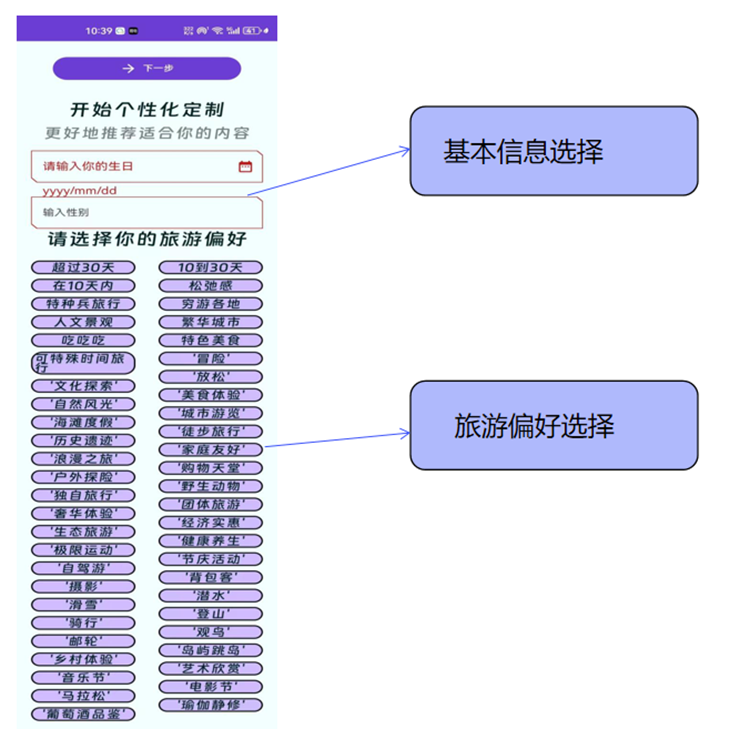

# REAMDME

# “我行”智能旅行助手

## 1.简介

APP由Android原生语言kotlin开发，UI部分使用了`material3` 库进行开发，网络部分使用了`retrofit2` 库，该作品是Android开发的练习项目，所以有诸多不完善的地方请多包涵，后端服务器目前已经关闭，无法请求接口，但是APP中有data文件，有模拟的测试数据。

通过调查问卷，我们发现用户对于出行旅游的工具的意见主要集中在以下三点:

1、**当前市场上的旅游工具虽然提供了多样化的旅游出行方案，但往往缺乏深度个性化，难以全面满足他们独特的个性化需求。**这些工具大多遵循标准化的规划流程，可能未能充分考虑到他们特定的兴趣、偏好和旅游目的，导致无法为用户提供更为精准和贴心的旅游体验。

2、**在旅游行程中，一旦遇到突发事件，现有的旅游应用程序往往缺乏有效的应变机制。**它们可能无法实时提供紧急情况下的应对策略或替代方案，比如天气变化、交通中断或健康危机等。这限制了旅游工具在处理不可预见事件时的灵活性和实用性，影响了他们在旅途中的安全感和满意度。

3、对于大部分年轻人来说，他们可能有些时候并不是想去游玩自然景观和名胜古迹，**他们更偏向于团体性的室内活动，如与几位朋友一起去网吧打游戏玩玩桌游吃吃小吃、与约会对象去看看电影共进晚餐、与同事们进行室内团建ktv唱歌野餐烧烤等**，现在市面上缺少规划适合年轻人娱乐活动的软件。

## 3.项目愿景

基于目前出行领域中“信息杂”、“规划难”、“调整烦”的痛点以及我们的见解和思考，我们计划利用人工智能生成内容技术（AIGC）为传统出行软件赋能，开发一款全新的智能出行规划软件。它将结合AIGC的技术与现有的大数据技术，提供个性化的出行推荐和规划服务
我们将这款智能出行规划软件命名为”我行”，将这款软件的标语定为“说走就走，从我行开始”。以美团、飞猪为代表的出行软件开启了中国人出行的“互联网+”时代，踏着AI的时代浪潮，我们希望“我行”的出现能让中国人的出行再方便一点，我行在手，说走就走。

## 3.基本界面

### 3.1用户个性化定制

### 3.2AI智能对话

### 3.3出行方案展示

## 4.项目框架介绍

**1.信息收集:**首先系统会对用户的信息进行收集，“我行”会与用户进行交互

收集用户的兴趣点以及用户对本次旅行的偏好，这是提供个性化服务的基础。

**2.问题拆分:之后**，系统将用户提出的问题细化为多个子问题，这样做可以帮助系统更精确地定位问题的核心，为后续的搜索和分析打下基础。

**3.RAG联网搜索:**在对问题进行拆分后，利用Retrieval-Augmented Generation（RAG）技术，系统将问题转化为问题向量。根据问题，系统会利用先进的搜索引擎去各大流量平台(如小红书、微博、抖音等)搜索对应的知识信息，将搜索到的相关知识转化为知识向量，接着系统将问题向量与知识向量进行匹配，通过计算两者之间的相似度，找出与问题最相关的知识点。这一步骤能推荐系统的核心，它确保了用户得到的信息是高度相关的。

**4.提示词工程:**系统将筛选出的最相关知识点合成为提示词，这些提示词作为输入，引导大型语言模型进行更深层次的提问和分析。这样，系统不仅能够提供基础的信息，还能够进行更复杂的推理和解释，为用户提供更全面、更深入的旅游建议。

**5.APP展示:**最后，系统将大模型输出的内容经过格式化处理后展示到Android开发的界面上供用户使用，我们设计并且搭建了简洁、美观的UI界面供用户使用。

## 5.**APP架构设计**

### 5.1 基本介绍

我们使用了Android推出的设计架构Compose，其是Google构建于原生Android界面的新工具包，其包含的materials Design3，Room和ViewModel等提供了强大的前端、交互于数据库支持，可以用更少的代码、更强大的kotlin API打造动态精美的应用。

如图3.11所示，先对总体进行设计程序入口为MainActivaty然后用户在第一次登录时，进入偏好选择页面，用户对自己的旅游偏好进行基本的选择，选择后系统会将用户选择的结果放入用户偏好数据库，在用户没有提前说明的前提下，这些偏好将随AI对话一起发送给大模型。进入主界面以后，最主要的功能是AI对话部分，通过对话大模型经过一系列处理返回可以显示给前端的方案数据，用户点击AI对话生成的方案选项，进入方案选择页面，方案选择页面包含了先前生成的所有方案可供选择，方案选择第一个方案即是刚才生成的方案，此页面包含方案的简略说明。下一个界面是时间表展示页面，此页面把方案以可视化的形式展示出来，包含两种状态，一种是待选择状态，另一种是已选择状态，行程的路线选择，出行的机票或者火车，会为用户提供选择，用户选择完成以后，行程中所有的住宿/出行/门票进行统一的支付，后端已经整理好所有的接口，所以只需要付一次钱就可以了。在时间表里的每一个行程都可以点进去看到更加详细的页面，比如出行界面会看到更加详细的火车始发重点站等信息，景点有更详细的游玩攻略展示和注意事项，餐馆有详细的套餐介绍等。

如图3.12，当用户在确定行程以后，用户可以对行程进行更改，用户可以通过对话的形式，对其进行更改，更改后的方案同样需要确定一些改动，改动后进入方案确定界面，进行补差价或退款到账。因为我们使用了Jetpack Compose架构，所以我们只有一个MainActivaty作为入口，剩下的界面使用navigation进行页面导航。我们用到了Compose提供的多组件进行实现，并且使用ViewModel进行状态管理，并且使用了Room作为与数据库进行交互的接口，如图3.13。

前端Compose组件继承ViewModel里的Remember()提供的数据类，而Remember类又继承自Room取用出的Flow()类型的参数，而Flow类型是可以把数据值的变动响应的，也就是说数据库中的数据如果有变动，在前端的Remember中会动态的刷新数据，因此我们另开后端线程，专门用来处理AI交互时发送的对话数据，返回的数据会写到对应的数据库中永久保存。

### 5.2 UI界面实现

时间展示页面设计

这是我们使用Figma进行设计的UI界面，其大致分为三个部分，上面的天数要随着手机滑动只移动横向x轴，而y轴不变，即天数栏一直在上面，在y轴滑动时，时间轴要随着y轴进行滑动，x值不变，而里面的旅游简略信息栏则需要根据天数和时间分配位置，并且要限制横向和纵向的大小不能超出每一天栏的大小。考虑到LazyRow和LazyColumn虽然对于单横向和单纵向的实现很方便，但是对于横纵轴的自定义联动有较大的限制，因此我们决定使用LazyLayout进行自定义布局的尝试。

这是我们LazyLout的布局结构，灰色的是手机大小返回的constrain对象，横纵坐标单位均为像素px，每个组件根据天数与时间的计算，得到布局的坐标，然后黄色区域为预加载区域，在此区域的组件返回对应的标签，在后面进行计算然后再进行布局，为了使布局更加丝滑，因此我们加入了threshold阈值，在手机constrain周围threshold范围内的组件均会被展示出来。

在屏幕进行移动时，如图3.15，协程捕捉屏幕的移动距离value.x和value.y两个偏移量，然后再对组件进行边界值的计算，在黄色边界里的组件则会被加入到预刷新的列表里。因为实际上有两个显示的坐标系，一种是LazyLayout的坐标系，一个是在手机屏幕上显示的坐标系，其均是在左上角为(0,0)原点坐标，因此我们在计算完要显示的组件坐标以后，我们还要在手机屏幕上计算出显示的距离，对于绿色的普通组件来说，只需要减去屏幕的偏移量即是组件在屏幕上的显示位置，但是对于橙色的天气组件来说，天气组件需要时刻随着屏幕的y轴偏移量移动，而x轴不变，那么我们只需要把橙色组件在LazyLayout中的坐标与屏幕的偏移量value.y相关联，在手机上的坐标恒定为0即可。同理我们也可以实现左侧的时间轴选项。